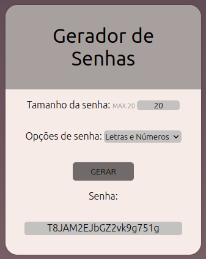
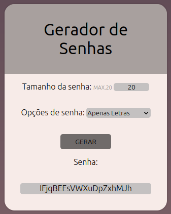
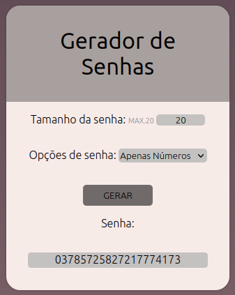

# Gerador de Senhas
Um gerador de senha criado com HTML, CSS e JAVASCRIPT. Aonde é possível gerar uma senha de até 20 caracteres, sendo misto de letras(maiúsculas e minusculas) e números(1 á 9) , apenas (maiúsculas e minusculas) ou apenas números.
## Exemplos

